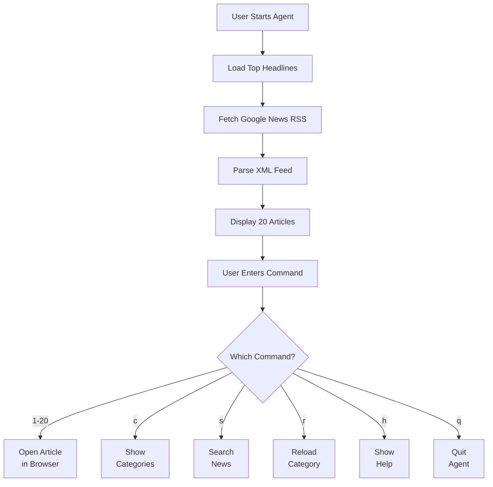
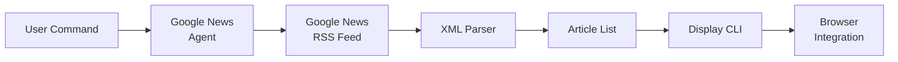
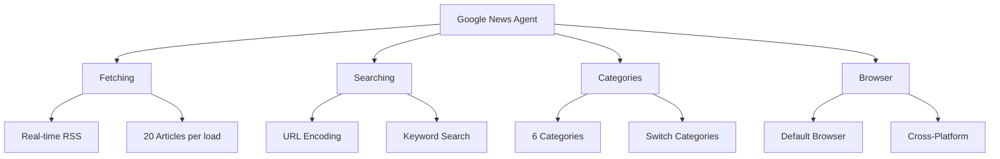

# Google News Agent

A Python command-line application that fetches and displays the latest news from Google News using RSS feeds.

## Features

✅ Real-time News - Fetch latest news from Google News  
✅ 6 News Categories - Top, Technology, Business, Science, Health, Sports  
✅ Search Functionality - Search news by keyword  
✅ Browser Integration - Open articles directly in your browser  
✅ Interactive CLI - Simple command-driven interface  
✅ Zero Dependencies - Uses only Python built-in modules  
✅ Error Handling - Graceful error messages and recovery  

## Quick Start

```bash
git clone https://github.com/kajalishere/google-news-agent.git
cd google-news-agent
python google_news_agent.py
```
# Google News Agent

A Python command-line application that fetches and displays the latest news from Google News using RSS feeds.

**Status:** ✅ Ready for GitHub Publication

## Features

✅ Real-time News - Fetch latest news from Google News  
✅ 6 News Categories - Top, Technology, Business, Science, Health, Sports  
✅ Search Functionality - Search news by keyword  
✅ Browser Integration - Open articles directly in your browser  
✅ Interactive CLI - Simple command-driven interface  
✅ Zero Dependencies - Uses only Python built-in modules  
✅ Error Handling - Graceful error messages and recovery  

## Quick Start

```bash
git clone https://github.com/kajalishere/google-news-agent.git
cd google-news-agent
python google_news_agent.py
```

## Application Architecture



## Data Flow



## Feature Components



## Commands

| Command | Description |
|---------|-------------|
| `1-20` | Open article by number |
| `c` | Show available news categories |
| `s` | Search for news |
| `r` | Reload current category |
| `h` | Show help |
| `q` | Quit |

## Usage Example

## Commands

| Command | Description |
|---------|-------------|
| `1-20` | Open article by number |
| `c` | Show available news categories |
| `s` | Search for news |
| `r` | Reload current category |
| `h` | Show help |
| `q` | Quit |

## Usage Examples

**View Top Headlines:**

**Search for News:**

**Switch Categories:**

## Requirements

- Python 3.11 or higher
- Windows, macOS, or Linux
- No external dependencies

## Technical Details

**Architecture**
- Language: Python 3.11.9
- Design Pattern: Object-Oriented (Single-file agent)
- External Dependencies: None (built-in modules only)
- Code Size: 280+ lines

**Built-in Modules Used**

```python
import urllib.request      # HTTP requests
import urllib.error        # Error handling
import xml.etree.ElementTree as ET  # XML parsing
import webbrowser         # Browser integration
from urllib.parse import quote  # URL encoding
from typing import List, Dict  # Type hints
from datetime import datetime   # Timestamps
```

**Key Methods**

- parse_feed(url) - Fetch and parse RSS feed
- display_articles(articles) - Format and display articles
- fetch_category(category) - Load news by category
- search_news(query) - Search news with URL encoding
- open_article(number) - Open in default browser
- run() - Main interactive loop

## Project Structure

## Testing

All features have been tested and verified working:

✅ Agent starts without errors  
✅ Loads top headlines (20 articles)  
✅ Displays formatted article list  
✅ Shows available categories  
✅ Switches between categories  
✅ Search works with spaces  
✅ Opens articles in browser  
✅ Handles errors gracefully  
✅ Help menu displays correctly  
✅ Quit command exits cleanly  

## Installation from Source

```bash
# Clone the repository
git clone https://github.com/kajalishere/google-news-agent.git
cd google-news-agent

# Run directly (no pip install needed)
python google_news_agent.py
```

## How It Works

1. Fetch News - Agent connects to Google News RSS feed
2. Parse RSS - XML parsing extracts articles
3. Display - Formatted list with titles and sources
4. User Input - Accept commands for navigation
5. Browser - Open selected articles in default browser

## Features in Detail

**News Categories**
- Top Headlines - Most popular stories
- Technology - Tech industry news
- Business - Business and finance
- Science - Scientific discoveries
- Health - Health and medicine
- Sports - Sports news

**Search**
- Natural language queries
- URL encoding for special characters
- 20 results per search
- Real-time news from Google

**Browser Integration**
- Opens articles in your default browser
- Cross-platform compatible
- Graceful fallback if browser unavailable

## Future Enhancements

- [ ] Persistent article history
- [ ] Bookmarking/favorites
- [ ] Custom category configuration
- [ ] Multiple news sources
- [ ] Article summarization
- [ ] Web UI version

## License

MIT License - See LICENSE file for details

## Contributing

Feel free to fork, modify, and use for your own projects.

## Disclaimer

This project fetches data from publicly available Google News RSS feeds. It is for educational purposes.

---
